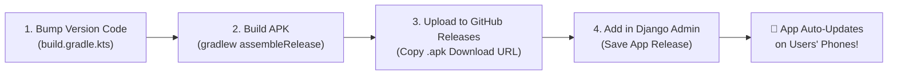

# 📱 SURE ProEd Android Mobile App — Future Release & OTA Update Guide

This guide is the permanent Standard Operating Procedure (SOP) for creating, building, and publishing Over-The-Air (OTA) updates to the SURE ProEd Android mobile app.

---

## ⚡️ Quick Release Cheat Sheet (4 Steps in 2 Minutes)



---

## 📋 Detailed Step-by-Step Instructions

### Step 1: Bump Version in `app/build.gradle.kts`
Open [app/build.gradle.kts](file:///c:/Users/tumma/Downloads/SureTrust-Andriod_App/app/build.gradle.kts) and increment `versionCode` by **+1** and update `versionName`:

```kotlin
android {
    defaultConfig {
        applicationId = "com.example.suretouchapp"
        minSdk = 24
        targetSdk = 35
        
        // ⬇️ UPDATE THESE TWO LINES FOR EVERY NEW RELEASE
        versionCode = 3          // Increment (e.g. 1 -> 2 -> 3)
        versionName = "1.2.0"    // Semantic version string (e.g. "1.2.0")
        ...
    }
}
```

---

### Step 2: Build the APK
Open your terminal inside the Android App project root:

#### For Production Release:
```cmd
cmd.exe /c "set JAVA_HOME=C:\Program Files\Android\Android Studio\jbr&& gradlew.bat assembleRelease"
```
*The APK will be generated at:*  
`app/build/outputs/apk/release/app-release.apk`

#### For Testing / Debug Build:
```cmd
cmd.exe /c "set JAVA_HOME=C:\Program Files\Android\Android Studio\jbr&& gradlew.bat assembleDebug"
```
*The APK will be generated at:*  
`app/build/outputs/apk/debug/app-debug.apk`

---

### Step 3: Host the APK (Recommended: GitHub Releases Free CDN)

1. Open your GitHub Repository in your browser: `https://github.com/<your-org>/<repo-name>/releases`
2. Click **"Draft a new release"**.
3. Choose a tag matching your version: `v1.2.0`.
4. Release title: `SURE ProEd v1.2.0`.
5. Attach the generated `app-release.apk` (or `app-debug.apk`) in the file drop area.
6. Click **"Publish release"**.
7. Under the published release's **Assets**, right-click the `.apk` file $\to$ click **"Copy link address"**.  
   *Example Link:*  
   `https://github.com/suretrust/SureTrust-Andriod_App/releases/download/v1.2.0/app-release.apk`

---

### Step 4: Publish in Django Admin

1. Open Django Admin in your browser:  
   👉 **[https://sureproed.com/secure-admin/common/apprelease/](https://sureproed.com/secure-admin/common/apprelease/)**
2. Click **"Add App Release"** in the top right.
3. Fill in the release details:
   - **Version Code**: `3` *(Must match `versionCode` from Step 1)*
   - **Version Name**: `1.2.0` *(Must match `versionName` from Step 1)*
   - **Download URL**: Paste your GitHub release APK link (e.g. `https://github.com/.../app-release.apk`)
   - **Release Notes**: Bullet points of what changed (displayed in the mobile update dialog)
   - **Is Mandatory**: 
     - ⬜️ *Unchecked* = User can choose "Update Now" or "Later"
     - ☑️ *Checked* = Mandatory update (locks the app until updated)
   - **Is Active**: ☑️ *Checked* *(Required to publish)*
4. Click **Save**.

---

### Alternative: CLI One-Liner (Via SSH)
If you are logged into the production server via SSH, you can publish a release instantly without opening a browser:

```bash
python manage.py shell -c "from common.models import AppRelease; AppRelease.objects.create(version_code=3, version_name='1.2.0', download_url='https://github.com/suretrust/SureTrust-Andriod_App/releases/download/v1.2.0/app-release.apk', release_notes='• Performance improvements\n• Bug fixes', is_mandatory=False, is_active=True); print('Published!')"
```

---

## 🔍 How to Verify the Release

Run a simple curl command to confirm the backend is serving the new version:

```bash
curl -i https://sureproed.com/api/app/version-check/
```

**Expected JSON Response (200 OK):**
```json
{
  "version_code": 3,
  "version_name": "1.2.0",
  "download_url": "https://github.com/suretrust/SureTrust-Andriod_App/releases/download/v1.2.0/app-release.apk",
  "release_notes": "• Performance improvements\n• Bug fixes",
  "is_mandatory": false,
  "file_size_bytes": 24680314
}
```

---

## 📱 What Happens on Users' Phones

1. When any student, mentor, or volunteer opens the SURE ProEd app, it checks `GET /api/app/version-check/` in the background.
2. Because the remote `version_code` (`3`) is greater than their installed `version_code` (`2` or `1`), the **Update Dialog** automatically pops up.
3. The user taps **"Update Now"**.
4. The app streams the APK with a live progress bar and automatically launches the native Android installer.
5. The app updates in place without losing any logged-in user session or data!
